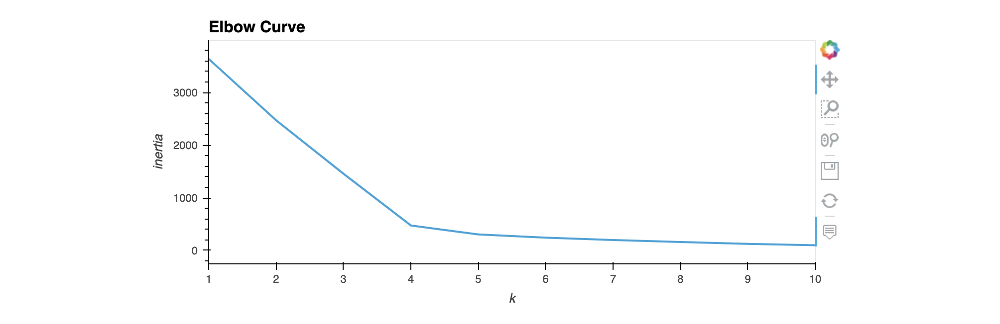
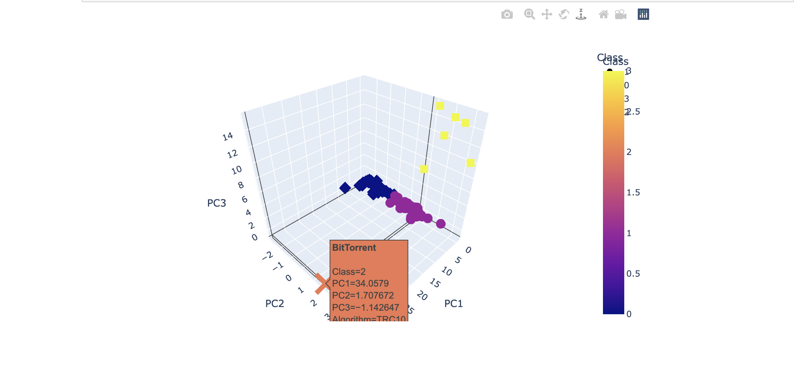
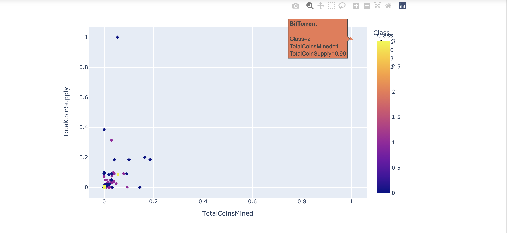

# Overview

In this module, *unsupervised machine learning* techniques are applied to analyze data. Fundamentally, in this type of unsupervised learning exercise, we are interested in finding if data can be *clustered*, and which attributes are important to determine the distinct clusters. 

Unline the *supervised learning* algorithms, we did not divide the data in training and prediction sets. Fundamentally, we gain no benefit from dividing the data in this way, since there is no clear target variable, and hence, there is no prediction to be done. Unsupervised learning algorithms are thus retrospective in nature, and are used to deduce patterns in data. 

# Analysis

In this exercise, data pertaining to cryptocurrencies is analyzed. We are given a number of exchanges, and various attributes for each exchange. The most important attributes are:

* Total coins mined until now
* Total coins that can be supplied by this exchange
* Algorithm to mine coins
* Type of proof

## Principle Component Analysis (PCA)

First, PCA was used to find the number of principle components that can explain a majority of data variance. We used three principle components.

## Number of Clusters (k) for the k-Means Clustering Algorithm

Second, we ran an analysis to find the optimal number of clusters this data set can be divided into. The *Elbow Curve* below shows four clusters are sufficient.

## Model Fitting and Data Segration (Phase One)

Data was segregated using the k-Means clustering algorithm. The figure below shows the four different clusters separated nicely. This gives us confidence that the k-means clustering algorithm has been effective in segrating data along the three principle component axis.

## Model Fitting and Data Segration using Scaling

In this phase, two attributes were scaled between 0 and 1 using the *MinMaxScaler* to normalize data across the exchanges. The k-means clustering algorithm was used again to segragate data; however, this time using only two attributes. The figure below shows the result.

It can be seen that removing one of the principle compoinents significantly affected the performance of the clustering algorithm despite scaling. Thus, we believe we should continue using the three principle components rather than the scaled versions of the two attributes.

# Conclusion

The unsupervised learning algorithms offer a powerful tool to detect patterns in the dataset when we do not have a clear objective. In the dataset of this problem, we had data from various cryptocurrency exchanges, but we don't have a clear objective such as predicting the coins in circulation by a future cryptocurrency exchange. All we wanted to do in this exercise is to determine if we could detect patterns in the data, which we did. We can use this information to conduct more advanced future analysis and use supervised learning techniques to make predictions.
